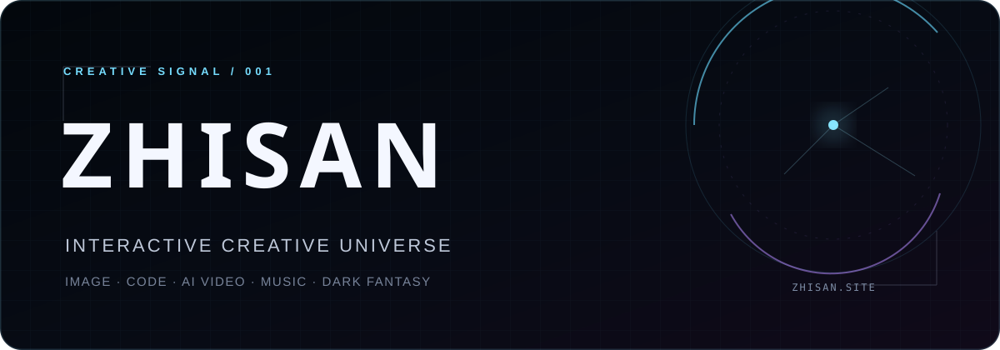
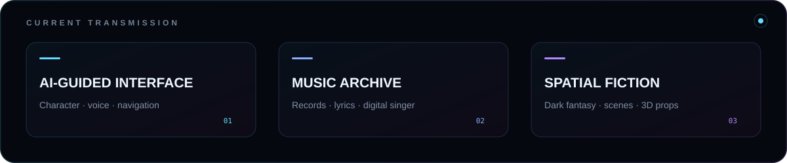

<p align="center">
  <a href="https://zhisan.site/">
    
  </a>
</p>

<p align="center">
  <a href="https://zhisan.site/"></a>
  <a href="https://github.com/zhisandesu/zhisan-creative-universe"></a>
  <a href="https://space.bilibili.com/24876045"></a>
</p>

## About / 关于我

I build perceptual worlds where **interactive interfaces, AI characters, original music, and dark-fantasy fiction** become one continuous experience.

我以 `zhisan` 的身份进行创作，关注影像、代码、AI 视频、音乐与叙事之间的连接。目前正在持续构建 [zhisan.site](https://zhisan.site/)：一个由数字角色引导、可以探索音乐与小说世界的个人创作宇宙。

<p align="center">
  
</p>

## Featured experience / 当前作品

<table>
  <tr>
    <td width="50%" valign="top">
      <a href="https://zhisan.site/">
        
      </a>
      <h3>AI-guided entrance</h3>
      <p>Choose ELARA or VELSHA and let a character become part of the interface—not just a chatbot beside it.</p>
    </td>
    <td width="50%" valign="top">
      <a href="https://zhisan.site/">
        
      </a>
      <h3>Music as an archive</h3>
      <p>Records, lyrics, waveform motion, digital singers, and music-video fragments live inside one explorable collection.</p>
    </td>
  </tr>
  <tr>
    <td width="50%" valign="top">
      <a href="https://zhisan.site/">
        
      </a>
      <h3>Fiction in three dimensions</h3>
      <p>《最后的落叶》从章节延伸至场景、三维书籍与可旋转的叙事物件。</p>
    </td>
    <td width="50%" valign="top">
      <a href="https://github.com/zhisandesu/zhisan-creative-universe">
        
      </a>
      <h3>Interface as atmosphere</h3>
      <p>Typography, particles, pointer motion, sound, and cinematic transitions turn the portfolio itself into a living work.</p>
    </td>
  </tr>
</table>

## Creative stack / 创作工具

<p>
  
  
  
  
  
  
  
  
</p>

```text
DESIGN      cinematic interfaces · motion systems · visual direction
BUILD       interactive web · 3D scenes · character experiences
CREATE      original music · dark fantasy · AI-assisted moving image
```

## Public notes / 公开记录

The production source and restricted creative assets remain private. I publish selected previews, design decisions, field notes, and reusable lessons in:

**[zhisan-creative-universe](https://github.com/zhisandesu/zhisan-creative-universe)** — the public development journal for the world behind `zhisan.site`.

<p align="center">
  <sub>正在接收来自另一个世界的信号 · New interfaces, songs, chapters, and character performances are added over time.</sub>
</p>
