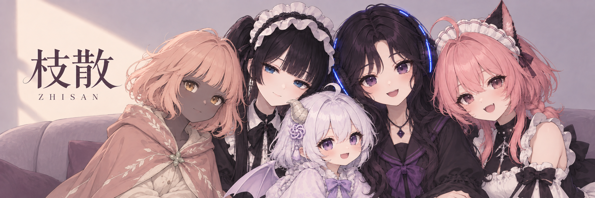

  

<h1 align="center">枝散 ZHISAN</h1>

  AI 视觉设计师 · 交互与独立项目创作者 
  做一些可以游玩、可以陪伴、可以慢慢探索的作品。

  <a href="https://zhisan.site/">个人网站</a> ·
  <a href="https://github.com/zhisandesu/codex-desktop-pet/releases/latest">下载柯朵桌宠</a> ·
  <a href="https://github.com/zhisandesu/zhisan-creative-universe">创作档案</a>

  <a href="#游戏与桌宠">游戏与桌宠</a> ·
  <a href="#网站与交互实验">网站与交互实验</a> ·
  <a href="#制作与协作">制作与协作</a>

## 关于我

我做 AI 视觉与交互设计，关注角色、游戏体验和内容制作流程。熟悉 Photoshop、Illustrator、ComfyUI、Stable Diffusion 与 LoRA 制作，也参与训练数据采集、清洗、标注及质量检查。

个人项目由我负责创意、视觉、交互方案和效果验收，程序与工具通过 Agent 辅助实现。

## 游戏与桌宠

<table>
  <tr>
    <td width="50%" valign="top">
      
      <h3>余色 · Afterglow</h3>
      
<b>开发中 · 三维探索 Demo</b>

      
从云边的石路走进庭院，探索角色、场景与花坛的互动。持续打磨视觉风格、关卡和游玩反馈。

      
<a href="https://zhisan.site/afterglow-journey/index.html">进入 Demo →</a>

    </td>
    <td width="50%" valign="top">
      
      <h3>空庭残响 · Hollow Garden</h3>
      
<b>开发中 · 横版探索 Demo</b>

      
在云间遗迹中行走、跳跃与对话。用角色序列帧、分层场景和花卉风格界面组织探索体验。

      
<a href="https://zhisan.site/cloud-conservatory-demo/index.html">进入 Demo →</a>

    </td>
  </tr>
  <tr>
    <td width="50%" valign="top">
      
      <h3>六境驿</h3>
      
<b>开发中 · 村庄探索 Demo</b>

      
围绕村庄、角色与场景交互制作探索原型，目前开放第一关体验。

      
<a href="https://zhisan.site/game-demo">进入 Demo →</a>

    </td>
    <td width="50%" valign="top">
      
      <h3>柯朵 · Codex 桌宠</h3>
      
<b>已发布 1.0 · Windows x64</b>

      
可以摸头、拖拽和自己玩耍的小龙娘，支持中文聊天、可选语音与 Codex 任务状态反馈。

      
<a href="https://github.com/zhisandesu/codex-desktop-pet/releases/latest">下载 →</a> · <a href="https://github.com/zhisandesu/codex-desktop-pet">项目仓库</a>

    </td>
  </tr>
</table>

游戏配图为项目宣传插画，实际内容以 Demo 为准。游戏仍在开发中，源码未随本主页公开。柯朵不是 OpenAI 官方产品，使用者需自行配置账号与可选语音服务。

## 网站与交互实验

[zhisan.site](https://zhisan.site/) 是我的个人创作网站，也是这些角色与作品共同的入口。在这里，可以听布朗琪的音乐、跟随埃拉拉与维尔莎浏览作品、阅读《最后的落叶》，也可以探索图像、三维展示与游戏 Demo。

我负责网站的视觉、角色呈现与交互设计，并通过 Agent 辅助实现。下面展示音乐粒子、角色导航和小说档案的实际界面，以及从网站角色交互延伸出的本地桌面伴侣实验。网站持续迭代，实际效果以在线版本为准。

[音乐与粒子](#音乐与音频响应粒子) · [角色助手](#角色助手与网站导航) · [小说与视觉档案](#小说与视觉档案)

### 音乐与音频响应粒子

把专辑视觉、播放状态和粒子运动连在一起，让画面随音乐变化。网站展示布朗琪的音乐内容，独立的粒子场实验也提供在线演示与开源代码。

[进入个人网站](https://zhisan.site/) · [体验粒子场](https://zhisandesu.github.io/audio-reactive-particle-field/) · [查看开源仓库](https://github.com/zhisandesu/audio-reactive-particle-field)

  
查看独立粒子场演示画面

  

### 角色助手与网站导航

  
  

让角色参与迎接访客、介绍作品和内容导航。埃拉拉与维尔莎用不同的语气连接音乐、小说与创作档案，结合语音和状态反馈形成网站的交互体验。

[进入网站，选择一位助手](https://zhisan.site/)

### 小说与视觉档案

《最后的落叶》持续整理小说、角色与场景创作。网站用书册、章节和视觉档案组织内容，也承载图像、音乐与三维物件的展示，让作品可以被阅读和探索。

[打开个人网站](https://zhisan.site/) · [查看创作档案](https://github.com/zhisandesu/zhisan-creative-universe)

### Lingmu / 本地 Live2D 桌面伴侣

  

开发中的 Windows 桌面伴侣实验，探索角色互动、对话、语音、本地记忆与任务反馈。重点是让角色通过动作、界面和声音回应操作，逐步打磨长期陪伴体验。

这是与柯朵不同的本地项目，尚未作为公开版本发布；这里只展示已筛选的界面，不公开私人配置、会话记录或项目源码。Live2D 模型使用既有资源，交互与应用部分由我设计并通过 Agent 辅助实现。

## 制作与协作

**视觉制作**　角色与场景、图像精修、AI 图像与视频、界面设计。 
**AIGC 工作流**　数据整理、LoRA 微调与效果迭代、素材筛选和质量验收。 
**Agent 协作**　需求拆解、交互原型、工具制作与项目交付。

参与主导 **Muse 多人、多 Agent 协作平台**的需求、交互与开发落地，通过 Agent 辅助实现任务协作与数据制作流程。这里只介绍工作方向，不公开内部代码或业务资料。

---

后续游戏进展、桌宠版本与新作品会继续整理到这里。

[头像](./assets/profile/blanche-avatar-round-2026.png) · [横幅](./assets/profile/zhisan-five-friends-2026.png) · [壁纸原图](./assets/profile/zhisan-anime-wallpaper-2026.png)

[Bilibili](https://space.bilibili.com/24876045) · [抖音](https://www.douyin.com/user/MS4wLjABAAAA4ilbBxHA5pg7QquOXi7S1nZzQTUeFTVTrodrUGpOaBX7Zx5GXJfYb8YMZWlTN_WR) · [小红书](https://www.xiaohongshu.com/user/profile/6a360b3b000000000e03d000)

页面插画为角色联动视觉，不代表游戏实机画面。个人项目包含 AI 辅助制作内容。
