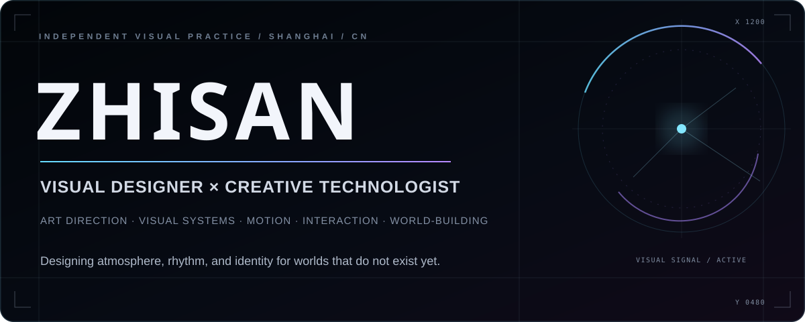
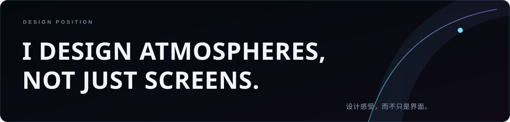
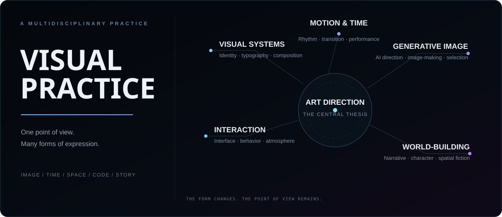
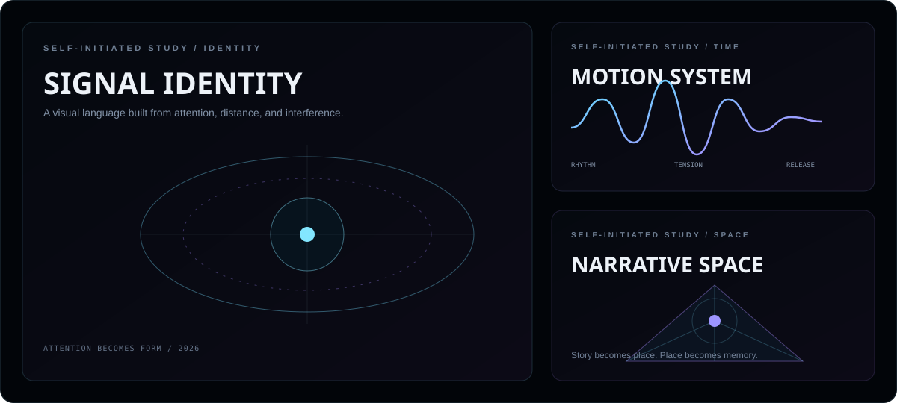
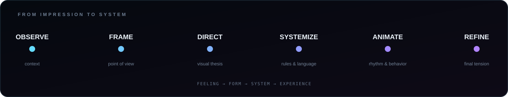
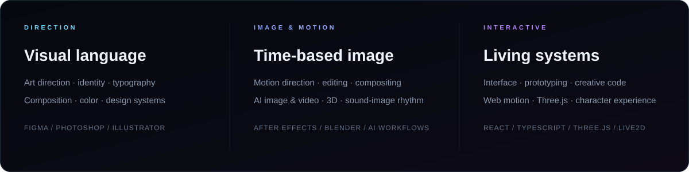

  

  
  
  

## Visual designer / 视觉设计师

I shape **visual identities, interface atmospheres, motion systems, and narrative worlds**. My practice moves between art direction and implementation—turning an idea into image, rhythm, interaction, and a coherent visual language.

我以 `zhisan` 的身份进行视觉创作，关注艺术指导、视觉系统、动态节奏、交互体验与世界观叙事。我希望作品不只解决“页面应该长什么样”，也能回答“它应该让人感受到什么”。

  

## Practice / 视觉实践

My work is multidisciplinary by design. Each project begins with a point of view, then grows into a system that can hold typography, image, sound, motion, character, and space together.

  

## Selected visual studies / 自主视觉研究

The following are self-initiated studies created for this profile. They explore identity through signal, movement through rhythm, and narrative through spatial composition.

  

## Working method / 工作方法

  

I prefer building a clear visual thesis before polishing individual screens. The result should remain recognizable whether it appears as a still image, a moving sequence, an interface, or a fictional object.

## Ongoing universe / 长期创作

<table>
  <tr>
    <td width="58%" valign="top">
      
      <h3>Character-led interaction</h3>
      
AI characters become part of the visual direction and navigation language—not an isolated chatbot layer.

    </td>
    <td width="42%" valign="top">
      
      <h3>World as interface</h3>
      
《最后的落叶》将暗黑幻想小说延伸为场景、三维物件与可探索的视觉档案。

    </td>
  </tr>
</table>

Music, fiction, character performance, and interactive design continue to meet inside [zhisan.site](https://zhisan.site/). Selected process notes and approved previews are documented in **[zhisan-creative-universe](https://github.com/zhisandesu/zhisan-creative-universe)** without publishing production source or restricted creative assets.

## Toolkit / 创作工具

  

  Available for visual conversations, creative experiments, and collaborations with a strong point of view. 
  持续接收来自图像、声音、代码与虚构世界的信号。

