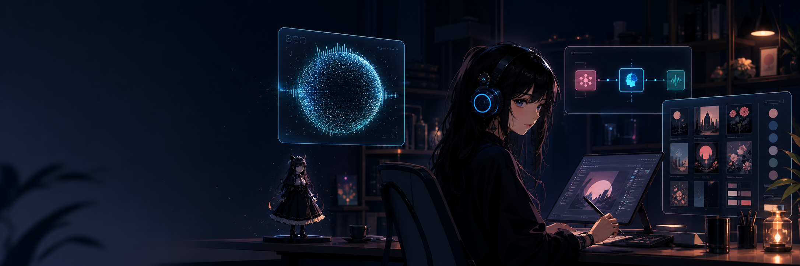
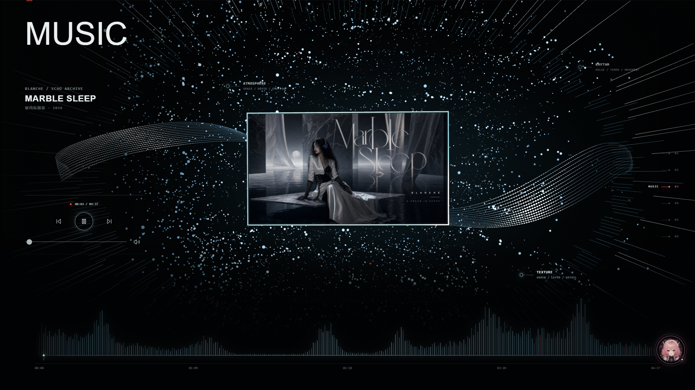
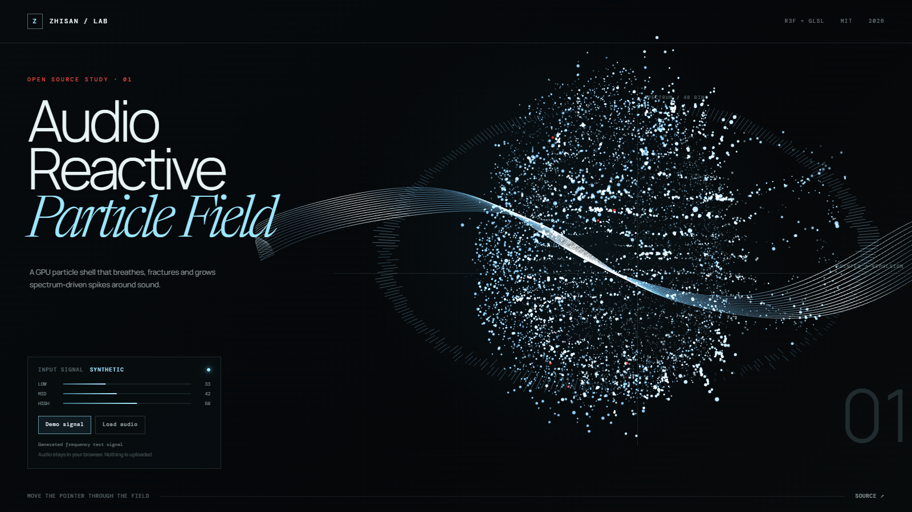
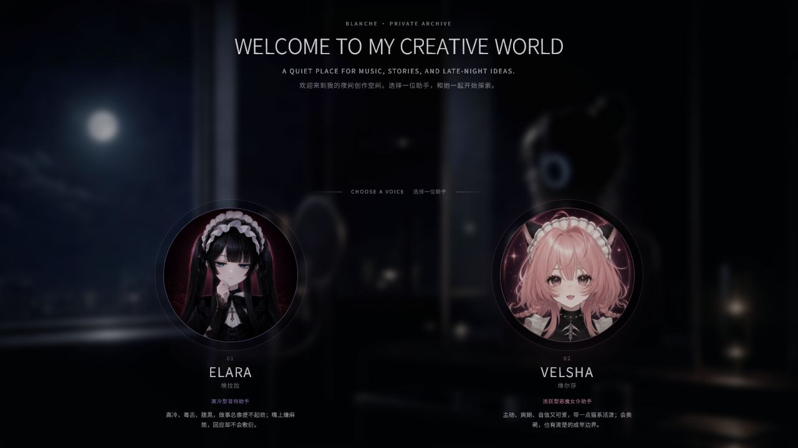
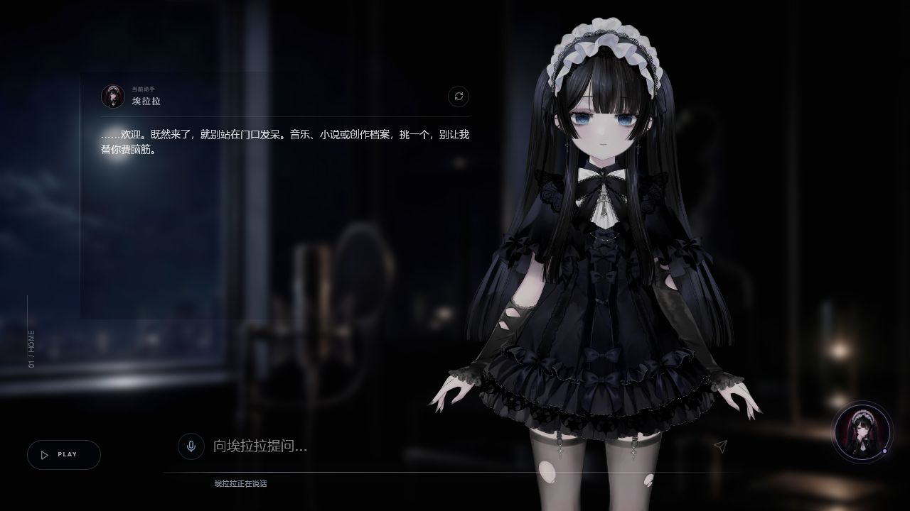
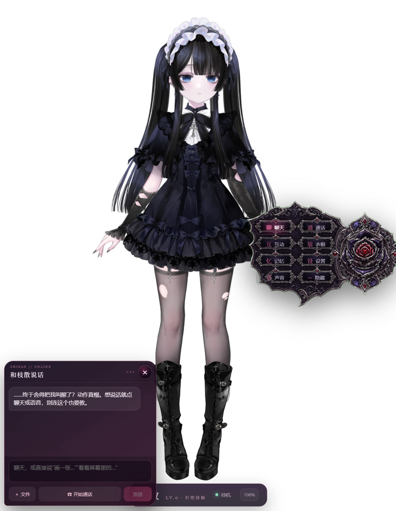
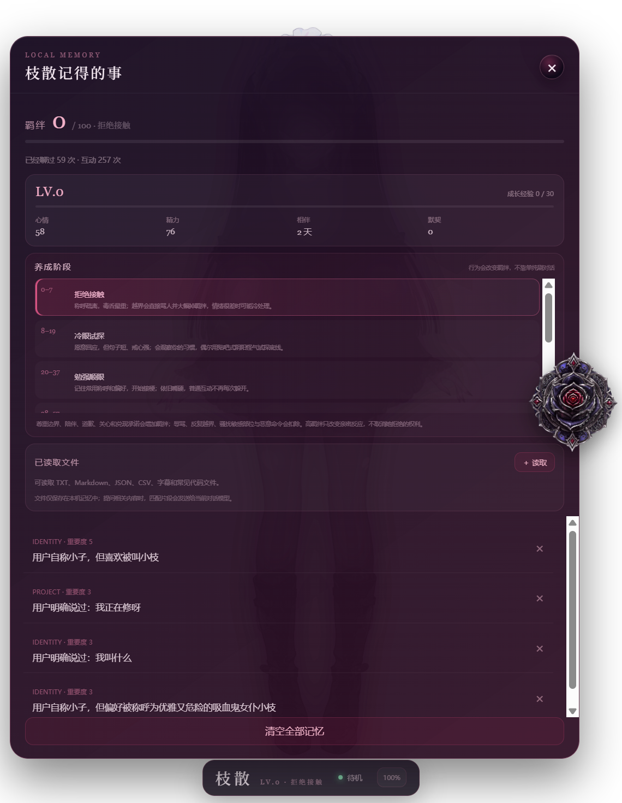
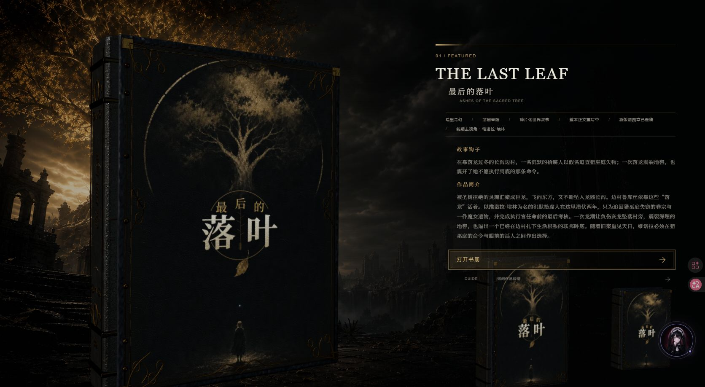

  

<h1 align="center">zhisan 枝散</h1>

  <b>Visual systems · AI agents · Generated worlds</b> 
  把视觉、角色、智能体和数字资产组织成可以持续生长的创作系统。

  
  
  

## Hello / 你好

我是 `zhisan`，一名视觉设计师，也在搭建 AI Agent 与生成式资产工作流。

我的工作从画面出发，但不止于画面：我设计界面与动态节奏，搭建带有记忆、语音和工具能力的角色型 Agent，也整理图像、视频、三维物件与叙事素材，让它们能在网站、桌面应用和内容创作中反复使用。

> **Current orbit**　视觉与交互设计　·　AI Agent 产品化　·　生成资产质量控制　·　角色与世界观系统

---

## 01 — Sound becomes space

### 音乐驱动的粒子界面

频谱不是装饰参数，而是界面的运动骨架。低频控制整体呼吸，中频推动行波，高频塑造轮廓尖刺；粒子、播放状态和版式共同构成一段可交互的音乐视觉。

  

`React` · `Three.js / R3F` · `GLSL` · `Web Audio`

**[打开在线演示](https://zhisandesu.github.io/audio-reactive-particle-field/)**　/　**[查看开源仓库](https://github.com/zhisandesu/audio-reactive-particle-field)**

---

## 02 — Characters become interfaces

### 角色不是悬浮聊天框，而是导航、语气与世界观的一部分

  
  

我在个人网站中尝试让数字角色承担真实的界面职责：迎接访客、介绍作品、引导音乐与小说内容，并通过语音和状态反馈维持角色感。视觉表现、交互逻辑和角色设定在同一套体验里工作。

**[进入 zhisan.site](https://zhisan.site/)**

---

## 03 — Agents become companions

### 枝散桌面宠物 / Local AI companion

  
  

“枝散桌面宠物”是一个 Windows 透明置顶的 Live2D Agent 实验。它连接长期会话、语音识别与合成、本地记忆、工具执行和角色互动；Electron 管理窗口、权限与角色表面，受控的 Agent 服务处理会话和工具调用。

这个项目关心的不只是“能不能聊天”，而是 Agent 如何长期存在、记住边界、调用工具，并通过角色动作和声音给出可信反馈。

`Electron` · `Live2D` · `OpenClaw` · `Voice` · `Local memory` · `Tool use`

本项目目前保留为本地开发版本，主页只展示经过筛选的产品画面。

---

## 04 — Assets become a system

### 从一次生成，走向可管理、可复用的资产库

我把角色图、概念设计、音乐封面、叙事画面和三维物件当作一套资产系统来管理。工作流覆盖方向设定、批量生成、质量检查、命名与版本、用途标记和交付整理；目标不是堆数量，而是让每份素材能回到具体的界面、故事或产品中。

`Art direction → Generation → Quality review → Versioning → Reuse`

其中，《最后的落叶》持续把小说章节扩展为场景、角色、收藏物与 3D-ready 设定；个人网站则把这些资产重新组织成可探索的视觉档案。

---

  
<b>How I work / 我的工作方式</b>

   
  <ul>
    <li><b>先定义体验：</b>明确情绪、叙事目标、交互路径和视觉层级。</li>
    <li><b>再搭建系统：</b>统一角色、界面、动效、声音、Agent 能力和资产规范。</li>
    <li><b>用真实画面验证：</b>在桌面端与移动端检查构图、节奏、可读性和性能。</li>
    <li><b>保留可复用结果：</b>整理组件、演示、质量记录与版本，而不是只留下最终截图。</li>
  </ul>

 

  
  
  

  ✦ Late-night interfaces, persistent agents, and small worlds that remember. ✦ 
  持续接收来自图像、声音、代码与虚构世界的信号。

